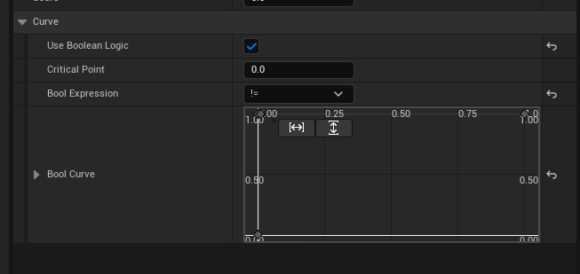

# Considerations

Each action's score is calculated by calculating scores of all of its considerations and then multiplying them with each other.
Considerations are defined in code or Blueprint by deriving from `UWFCoonsideration` class.

After defining a consideration, you can add it to actions of a Behavior asset.
To add considerations to actions

- Implement a consideration in a class.
- Select the desired behavior asset and double click on it to open its editor.
- Select the action which you want to add the consideration to by clicking on it.
- Now in the considerations list for the action click Add Consideration and from the context menu choose the implemented consideration.
- Set the curve and the parameters of the consideration as you desire.

The consideration can be defined like this in C++:

```
// Fill out your copyright notice in the Description page of Project Settings.

#include "Considerations/UAIConsideration_MyAmmo.h"
#include "UAICharacter.h"
#include "UAISampleTypes.h"
#include "UAIWeapon.h"

//---------------------------------------------------------------------------------------
// CTOR/DTOR & VIRTUAL FUNCTIONS
//---------------------------------------------------------------------------------------

void UUAIConsideration_MyAmmo::OnBeginPlay_Implementation()
{
	Super::OnBeginPlay_Implementation();
	Character = Cast<AUAICharacter>(GetControlledActor());
}

//---------------------------------------------------------------------------------------

float UUAIConsideration_MyAmmo::GetValue_Implementation(const AActor* InTargetActor)
{
	if (IsValid(Character.Get()) && IsValid(Character->Weapon.Get()))
	{
		const float TotalBullets = Character->Weapon->TotalBullets;
		const float MaxBullets = Character->Weapon->MaxBullets;
		const float Value = TotalBullets / MaxBullets;
		return Value;
	}

	return 0.0f;
}
```

Or like this in Blueprint

`OnBeginPlay()` is called when the consideration is initialized after the `UUtilityAIComponent` component is created or the behavior asset is added to an already existing component at runtime.

`GetValue()` is called whenever the action wants to calculate its score.

What you return in GetValue should be a number between 0 and 1 (both inclusive) which will be fed to the curve of the consideration as the value for the x axis and the y axis value at that point on the curve is the score of the consideration used in score calculations.

You can check the box for having targets in the behavior editor UI for the consideration so the action's current target is passed to the consideration if needed.

As you can see this consideration assumes that the consideration is used in an actor which is owned by a controller (usually an AIController).

## Setting curves for considerations

When you use a consideration with an action, you set its curve depending on what the action needs.
For example if your action needs to consider the distance of the agent with a target, it might want to have a higher score if the target is closer or a lower score if it is closer. It also might want a linear relationship or an exponential one.
Usually what you want is a curve which goes from 0 to 1 and returns a value between 0 and 1 depending on the shape of the curve, but sometimes you want a boolean curve which returns 0 when the x axis is less than a value or less than or equal a value and 1 otherwise.



As you can see you can modify the number which is the border between 0 and 1 and also the operator used to decide what happens to the number around the border.


For more information, check the sample and the source code out.