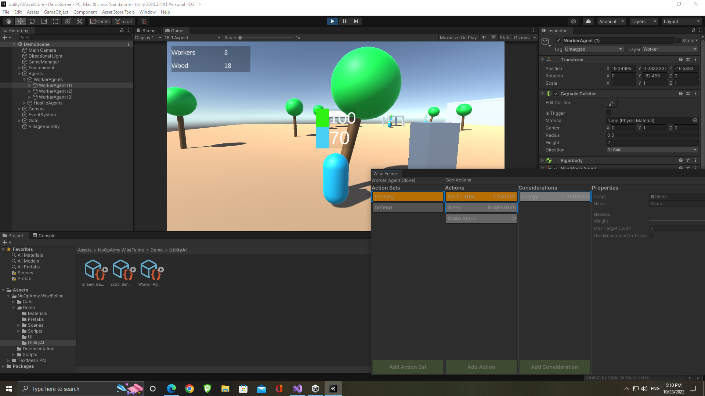

# How to Debug

There are multiple ways to debug the AI systems of Wise Feline.

- Wise Feline Debugger
- Visual Logger
- GamePlay Debugger

## Wise Feline Debugger

This window can be openned by going to *Tools>Wise Feline Debugger* menu in the Unreal editor.

You can debug your AI scoring by selecting a an actor which has a [`WFUtilityAIComponent`](utilityaicomponent.md) component attached (or is posessed by an AI Controller  which has one) at runtime while the Wise Feline Debugger window is open.
The window then shows the list of actions available to the agent and shows you what score each of the actions got.
You can also sort the list of actions by score.

The window looks like this 

As you can see the left most column are the actions and then considerations.
The window updates whenever scores are updated.

## Visual Logger

All `WFUtilityAIComponent`s write their log to the visual logger which can be openned using the vislog console command or from the Unreal menu bar.
It both prints actions and their scores to the log and the snapshot and also draws shapes which help you debug and mark action change events as well.

This and in general visual logger are very helpful for reproducing bugs and situations which others ran into, specially because it allows you to move back and forth between recorded frames.

For more information, check Unreal's Visual Logger documentation.

## Gameplay Debugger

The GamePlay Debugger is also a very helpful tool which at runtime shows scores of your top actions to you so you can see why an AI agent is doing something and not something else and if you need deeper debugging, then you can use the debugger or visual loggere to dig deeper.