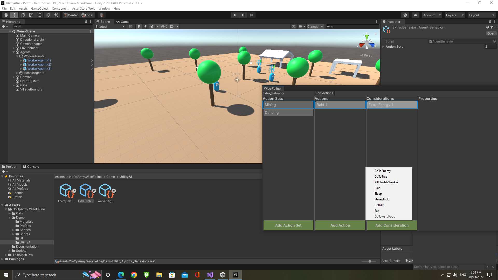

# Wise Feline Editor Window

The editor window can be opened at Window>NoOpArmy>Wise Feline

When the window is open you can select a [Behavior Agent](behaviors.md) asset and then edit the actions, considerations and action sets available in the asset.

At runtime the window can be used to [debug](debug.md) the scores of actions to see if curves and waits are set correctly to get the results you want.
You just need to select game objects which have the [brain](brain.md) attached in the hierarchy/scene and then open this window to see how its scores are being calculated.