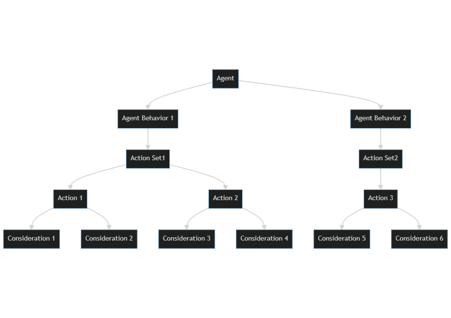

# Welcome to Wise Feline

Wise Feline is a utility AI system.
Wise Feline allows you to make an AI which feels unscripted and immersive and allows you to do this in a fraction of the time it takes to do AI in a scripted and sequencial manner.
Wise Feline uses Utility theory and by extension the Utility AI approach championed by Dave Mark in the games industry which is used in games as big as the sims and guild wars 2.

# Philosophy

An AI system usually needs to perform two functions, listing the actions which can be taken and choosing an action from the list to execute.
Utility AI does this by giving all possible actions a score between 0 and 1 and then chooses the action with the highest score.

Each action has a set of considerations which estimate the action's utility at the moment.
Each consideration has a score between 0 and 1 based on the current parameters supplied to it.
Each action's score is calculated by calculating the score of all of its considerations and then multiplying them by each other.

This is how humans take decisions. For example if you have actions below:

- Buying food
- Eating food
- having a rest

Then the eating food action probably would have two considerations for calculating if the agent is hungry or not and also calculating if the agent has food or not.
The consideration for being hungry is a continuous value between 0 and 1 but the having food available consideration is a binary which is either 0 or 1.
The score of the action is calculated by multiplying these two so when the agent doesn't have food, the score for eating food will always be 0 since you don't have any food to eat.

Buying food on the other hand has considerations for not being tired and not having food and being hungry and these should return their values in a way that if you are very hungry, the score becomes high even if you are tired.
Resting action probably should only give a high score if you are tired but not that hungry.

Each consideration is a function of a curve which its x axis is the value that we read from the agent/environment and its y axis is the output score of the consideration.
So for hunger we read the hunger value of the agent and return it and then its value is given to a curve as x axis and the resulting y axis is the actual score of the consideration.
In this way we can make a consideration more sensitive to certan values so for example having a hunger of 0.5 can return 0.5 in the case of a linear curve and 0.9 or 0.1 in the case of custom curves.

These curves for considerations are the main way that designers make the agent react the way they want.
For example if you want the agent to go find some food and eat no matter what if the hunger goes above 0.9, you add a consideration to buying food and having food which gives the score of 1 back if hunger is above 0.9 and you might even give a revurse consideration to actions which are not important when you are hungry so as hunger goes up it returns a lower score.
The same hunger consideration but with different curves can be used for the purpose in different actions.

# How the system works

This is the architecture diagram of the system

Any actor which want to be controlled by utility AI should have a [WFUtilityAIComponent](utilityaicomponent.md) component attached to itself or the AI Controller possessing it.
This component executes the main utility AI logic by executing all action considerations once in a while and choose a high scoring action to do.
Then it calls callbacks of the chosen action which can drive the agent in the world. 
The action and the considerations have access to the `WFUtilityAIComponent` and the actor which owns it.

[Actions](actions.md) which an agent has, have their own considerations listed under them with custom curves per action. 
A group of actions themselves are stored in an asset called [WFBehavior](behaviors.md) which is what you attach to a `UUtilityAIComponent` to use.

So the root of the tree is the `WFUtilityAIComponent` component which has a set of actions attached and each action contains a set of their own considerations.

You define [actions](actions.md) and [considerations](considerations.md) by deriving classes from `WFAction` and `WFConsideration`.

To create each agent's AI you:
- Create an [WFBehavior](behaviors.md) by right clicking in the content browser and choosing Wise Feline > Behavior.
- Name it whatever makes sense.
- Double click on the WFBehavior asset you just created. The editor window opens.
- Now add actions and considerations and action sets to the behavior.

Different pages of this manual describe each of these items in detail. Read them and come back to this for the bigger picture again to understand it well. 
There is also a [sample](sample.md) which helps you by showing how to implement a semi-realistic sample.